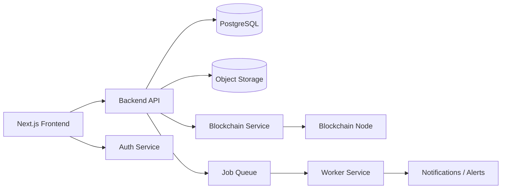

# AgriTrust Backend System Design

## 1. Purpose
This backend design is based on the current AgriTrust product flow in the Next.js app: farmers register produce batches, inspectors verify compliance, distributors move goods, regulators review records, and consumers can verify traceability.

The backend should support:
- secure user authentication and role-based access
- farm and batch lifecycle management
- inspection and certificate issuance
- audit trail and compliance reporting
- blockchain event synchronization
- alerts, analytics, and traceability queries

## 2. Recommended Architecture

### Core Stack
- Frontend: Next.js 16
- Backend API: Node.js + TypeScript (NestJS or Express)
- Database: PostgreSQL via Supabase
- File storage: Supabase Storage or Azure Blob Storage
- Auth: Supabase Auth or NextAuth-compatible session auth
- Queue/worker: BullMQ or background jobs for blockchain sync and notifications
- Observability: OpenTelemetry + structured logs + metrics

### High-Level Components

## 3. Domain Model

### Main Entities
- User
- Farm
- Batch
- Inspection
- ComplianceCertificate
- ShipmentEvent
- AuditLog
- Alert
- Document
- BlockchainTx

### Roles
- FARMER
- INSPECTOR
- DISTRIBUTOR
- REGULATOR
- CONSUMER

## 4. Backend Modules

### 4.1 Authentication and Authorization
Responsibilities:
- register and login users
- verify wallet or email-based identity
- enforce role-based access control
- issue JWT/session tokens

Rules:
- Farmers can manage only their own farms and batches
- Inspectors can create inspections and issue certificates
- Regulators can review flagged batches and revoke certificates
- Distributors can update shipment events

### 4.2 Farm Management Service
Responsibilities:
- create and update farms
- store geolocation, owner, region, and compliance status
- link farms to users and regulators

### 4.3 Batch Management Service
Responsibilities:
- create batch records
- store crop type, quantity, seed variety, GMO declaration, farm origin
- update lifecycle status from registration to delivery
- generate batch IDs and QR references

### 4.4 Inspection and Certification Service
Responsibilities:
- create inspection entries
- record safety test results, residue analysis, GMO confirmation
- issue or revoke certificates
- attach evidence documents

### 4.5 Traceability and Audit Service
Responsibilities:
- track every movement of a batch across stages
- record warehouse, inspection, distribution, and market events
- provide full audit history for regulators and consumers

### 4.6 Notification and Alert Service
Responsibilities:
- send alerts for overdue inspections, flagged batches, certificate expiry, and shipment delays
- support email, SMS, and in-app notifications

### 4.7 Reporting and Analytics Service
Responsibilities:
- provide dashboards for farmers, regulators, and distributors
- summarise compliance scores, batch status, and historical trends

## 5. API Design

### Authentication
- POST /auth/register
- POST /auth/login
- POST /auth/refresh
- POST /auth/logout

### Farms
- GET /farms
- POST /farms
- GET /farms/:id
- PATCH /farms/:id

### Batches
- GET /batches
- POST /batches
- GET /batches/:id
- PATCH /batches/:id/status
- GET /batches/:id/trace

### Inspections
- POST /batches/:id/inspections
- GET /batches/:id/inspections
- PATCH /inspections/:id

### Certificates
- POST /batches/:id/certificates
- GET /certificates/:id
- PATCH /certificates/:id/revoke

### Events and Audit Trail
- POST /batches/:id/events
- GET /batches/:id/events
- GET /audit-logs

### Alerts and Reports
- GET /alerts
- GET /reports/compliance
- GET /reports/analytics

## 6. Database Design

### Recommended Tables
- users
- user_roles
- farms
- batches
- inspections
- certificates
- batch_events
- documents
- alerts
- audit_logs
- blockchain_transactions

### Key relationships
- one user can own many farms
- one farm can have many batches
- one batch can have many inspections and events
- one batch can have one active certificate
- each event and certificate should be tied to a blockchain transaction record

## 7. Suggested Database Schema
Use PostgreSQL with UUID primary keys and timestamps.

### Example fields
- users: id, email, password_hash, full_name, role, wallet_address, created_at
- farms: id, owner_id, name, region, gps_lat, gps_lng, compliance_score, created_at
- batches: id, batch_number, farm_id, crop_type, quantity_kg, seed_variety, gmo_status, status, registered_at
- inspections: id, batch_id, inspector_id, result, notes, passed, created_at
- certificates: id, batch_id, inspector_id, certificate_number, status, issued_at, expires_at
- batch_events: id, batch_id, stage, actor_id, event_type, metadata_json, created_at
- documents: id, batch_id, document_type, storage_url, checksum, created_at
- alerts: id, user_id, severity, title, message, is_read, created_at
- audit_logs: id, actor_id, entity_type, entity_id, action, details_json, created_at
- blockchain_transactions: id, batch_id, tx_hash, network, status, created_at

## 8. Security and Compliance
- encrypt sensitive records at rest
- store only hashes and metadata on-chain, never private documents directly on-chain
- use signed API requests and role-based policy checks
- maintain immutable audit logs for regulators
- support data retention and export policies for compliance reviews

## 9. Deployment Plan
### Phase 1
- set up PostgreSQL database and auth service
- implement farms, batches, inspections, and certificates
- expose basic REST APIs

### Phase 2
- add blockchain sync workers
- implement alerts and reporting
- add QR verification endpoint for consumer scanning

### Phase 3
- add analytics, export features, and admin dashboards
- integrate with external inspectors or regulatory systems

## 10. Next Implementation Steps
1. create the database schema
2. implement the backend API skeleton
3. connect the frontend forms to the API
4. add blockchain transaction listeners
5. add reporting and alerting
