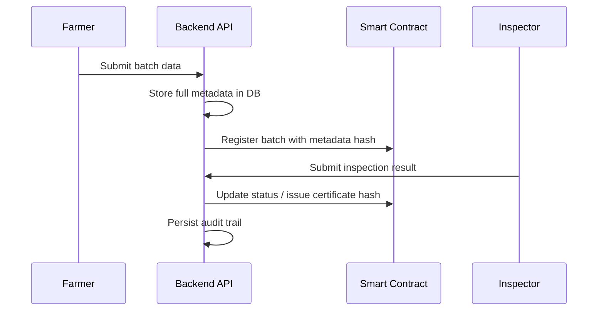

# AgriTrust Blockchain System Design

## 1. Goal
The blockchain layer should provide immutable traceability for agricultural batches without storing large documents or private records directly on-chain.

This fits the current app well because the UI already presents a traceability journey with batch IDs, inspection history, and compliance status.

## 2. Design Principles
- store only critical provenance events on-chain
- keep detailed data in the backend database
- use hashes to link off-chain data to on-chain records
- make the chain auditable for farmers, inspectors, distributors, and regulators
- keep gas usage low and transactions simple

## 3. Recommended Blockchain Setup
- Network: Ethereum-compatible testnet first, then Polygon or Base for lower cost
- Smart contract language: Solidity
- Development tool: Hardhat
- Wallets: backend-managed signer wallets or custodial wallet service
- Identity: role-based access controlled by contract owner or trusted regulator addresses

## 4. Smart Contract Architecture

### Suggested contracts
- AgriTrustRegistry.sol
  - register batches
  - update batch status
  - emit events for stage changes
- CertificateRegistry.sol
  - issue certificates
  - revoke certificates
  - attach certificate hash
- AccessControl.sol
  - manage farmer, inspector, and regulator roles

### Simplified approach
For a first version, one contract is enough:
- BatchRegistry
- certificate issuance and revocation
- role-based access controls
- emitted events for audit trail

## 5. On-Chain Data Model
Each batch should have a compact on-chain record:
- batchId
- farmId
- currentStatus
- metadataHash
- certificateHash
- ownerAddress
- updatedAt
- version

### Example fields
```solidity
struct BatchRecord {
    bytes32 batchId;
    address owner;
    address issuer;
    uint256 registeredAt;
    uint256 updatedAt;
    uint8 status;
    bytes32 metadataHash;
    bytes32 certificateHash;
}
```

## 6. Off-Chain vs On-Chain Data

### Store on-chain
- batch registration event
- inspection approval or rejection
- certificate issuance or revocation
- batch status change
- hash of off-chain metadata

### Store off-chain
- full farm profile
- product images
- lab reports
- shipping documents
- long-form notes
- compliance attachments

## 7. Workflow

### 1. Batch Registration
A farmer submits batch data through the backend.
The backend stores the full record in PostgreSQL and computes a hash.
The backend submits a transaction to the blockchain with:
- batch ID
- farm ID
- metadata hash
- initial status

### 2. Inspection
An inspector reviews the batch.
The backend records the inspection result in PostgreSQL.
If passed, the backend writes a transaction to update the batch status and attach a certificate hash.

### 3. Distribution
A distributor updates movement, warehouse, and transport events.
The backend writes these as immutable events linked to the batch.

### 4. Verification
A consumer scans a QR code or enters a batch ID.
The app retrieves the on-chain record and the off-chain record from PostgreSQL to present a full verified history.

## 8. Event Design
Important events:
- BatchRegistered
- BatchStatusUpdated
- InspectionRecorded
- CertificateIssued
- CertificateRevoked
- ShipmentUpdated

Each event should include enough information for auditing without exposing large payloads.

## 9. Security Design
- use role-based contract access
- restrict certificate issuance to approved inspector addresses
- require multi-step validation before changing status to certified or flagged
- validate hashes before accepting metadata updates
- protect admin keys with a hardware wallet or secure vault

## 10. Upgrade and Governance Strategy
For the first version, keep the contract simple.
Later, add:
- upgradeable proxy pattern
- multi-signature admin approval
- regulator governance for certificate revocation
- cross-chain compatibility if needed

## 11. Recommended Contract Flow


## 12. Implementation Roadmap
### Phase 1
- create smart contract skeleton
- add batch registration and status updates
- connect backend to contract deployment

### Phase 2
- add inspection and certificate issuance
- add event listeners and transaction status tracking

### Phase 3
- add QR verification flow
- support regulator review and certificate revocation
